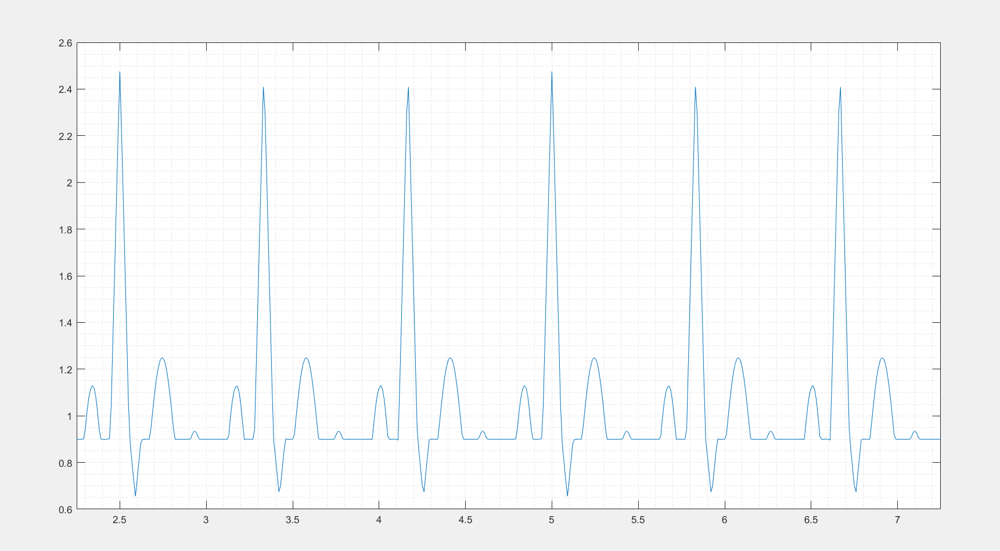

# Electrocardiogram (ECG) simulation using MATLAB

Introducing our MATLAB-based ECG Simulation project, a cutting-edge tool designed to generate diverse ECG waveforms for medical training. This simulator caters to the growing demand for efficient training tools, allowing medical professionals, students, and researchers to analyze and study both normal and abnormal ECG patterns without the need for invasive procedures.

The simulator's key distinction lies in its use of the Fourier series principle, ensuring accurate waveform generation. By leveraging mathematical calculations grounded in Fourier series, our simulator provides a streamlined and time-efficient alternative to traditional methods. The attached file contains detailed descriptions of the calculations and methodologies, offering transparency into the simulation process. In summary, our ECG simulation project aims to advance medical education and research, providing a valuable resource for a deeper understanding of cardiac electrophysiology, arrhythmias, and related medical fields through the integration of MATLAB and innovative simulation techniques.

## Simulation



## Table of Contents

- Installation
- Features
- References

## Installation

```bash
  -Go to my project link below
  -Copy/fork it on your account
  -Run Locally by starting Simulation on matlab
```

## Features

- **Real-Time Monitoring:** The system continuously monitors the driver's condition in real-time, providing immediate feedback and alerts.

- **MATLAB-Based Simulation:**  Utilizes the power of MATLAB for accurate and versatile ECG waveform generation, making it accessible to a wide range of users in the medical field.

- **Diverse ECG Patterns:**  Capable of producing typical ECG waveforms from various leads and simulating a comprehensive array of arrhythmias, providing a thorough educational resource for medical professionals and students.

- **Time-Efficient Training:**  Offers a time-efficient alternative to traditional methods by eliminating the need for invasive or cumbersome noninvasive techniques, streamlining the process of studying normal and abnormal ECG patterns.

- **Fourier Series Implementation:**  Stands out through the incorporation of the Fourier series principle, ensuring a high level of accuracy in waveform generation. Detailed descriptions of the calculations and methodologies are included for transparency.

- **Versatile Analysis Platform:**  Provides a comprehensive platform for in-depth analysis and study of ECG patterns, contributing to the advancement of medical education and research in cardiac electrophysiology and related fields.

- **Educational Resource:**  A valuable tool for medical professionals, students, and researchers seeking a deeper understanding of cardiac electrophysiology, arrhythmias, and associated medical disciplines.

## Getting Started

For Actual Implementation

```
1. Clone this repository to your local machine.

2. Open the `main.m` file with all its coordinating files using the MATLAB IDE.

3. Upload the code to your MATLAB.

4. Make sure all the files are in same place.

5. Run the main file.

6. Note the Obeservations
```

## Reference

- [Matlab Documentation](https://in.mathworks.com/help/matlab/)

- [MathWorks](https://in.mathworks.com/matlabcentral/fileexchange/10858-ecg-simulation-using-matlab)
